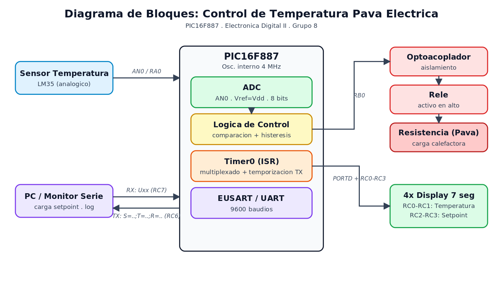

# Control de Temperatura para Pava Eléctrica

> **Asignatura:** Electrónica Digital II — Universidad Nacional de Córdoba
> **Integrantes:**
> * [Nombre Apellido]
> * [Nombre Apellido]
> * [Nombre Apellido]
>
> **Profesor:** [Nombre del Profesor]
> **Grupo:** 8

---

## 🚀 1. Descripción General del Proyecto

Sistema embebido de control de temperatura para una pava eléctrica, implementado sobre un microcontrolador **PIC16F887**. El usuario fija un **umbral de temperatura (*setpoint*)** enviándolo por **UART** desde la PC (comando `U` + valor + ENTER, p. ej. `U70`). El sistema mide de forma continua la temperatura del agua con un **sensor analógico** (canal AN0) y, mediante un **optoacoplador**, comanda un **relé** que habilita la resistencia calefactora de la pava. El control es por **histéresis**: el relé enciende cuando la temperatura cae por debajo del umbral y se apaga al alcanzarlo, evitando conmutaciones constantes.

La información se presenta en **4 displays de 7 segmentos multiplexados** (dos para la temperatura sensada y dos para el setpoint configurado) y, en paralelo, se transmite el estado completo por **UART** hacia el monitor serie de una PC una vez por segundo, con el formato `S=<setpoint>;T=<temperatura>;R=<estado_relé>`. El sistema está pensado como un control on/off con histéresis para calentamiento de agua con apagado automático.

### 🎯 Alcances del Proyecto (¿Qué hace y qué NO hace el sistema?)

* **El sistema SÍ es capaz de:** medir la temperatura en tiempo real mediante el ADC interno; recibir y fijar el umbral por comando UART (`Uxx`); controlar la resistencia a través de un relé comandado por optoacoplador, con lógica de histéresis; mostrar simultáneamente temperatura y setpoint en 4 displays de 7 segmentos; y reportar el estado (setpoint, temperatura y relé) por UART cada ~1 segundo.
* **El sistema NO incluye (Fuera de alcance):** carga del umbral por teclado físico (se hace por puerto serie); control de temperatura por algoritmo PID (es on/off con histéresis); almacenamiento local de datos (data logging); conectividad inalámbrica; ni interfaz gráfica dedicada (el monitoreo se realiza por monitor serie).

### ⏩ Posibles Etapas Siguientes (Líneas Futuras)

* Agregar un teclado matricial para configurar el setpoint de forma local, sin depender de la PC.
* Implementar un control PID para mantener la temperatura estable en lugar del control on/off por histéresis.
* Migrar el circuito de protoboard a un PCB con aislamiento reforzado entre la etapa de potencia (relé / red de 220 V) y la etapa de control de baja tensión.
* Desarrollar una interfaz gráfica (GUI) en Python o una app móvil para configurar el umbral y graficar la temperatura de forma remota.

---

## 📐 2. Arquitectura del Sistema: Hardware y Software

### 🔌 Hardware & Interconexión

* **Diagrama de Bloques:**

  
* **Esquemático del Circuito:** *[Inserte aquí la captura/render del esquemático completo desarrollado en KiCad/Altium/Proteus]*
  ``
* **Asignación de pines (según firmware):**

  | Pin            | Función                                              |
  |----------------|------------------------------------------------------|
  | RA0 / AN0      | Entrada analógica del sensor de temperatura          |
  | RB0            | Salida al optoacoplador → relé (activo en alto)      |
  | PORTD (RD0–RD6)| Segmentos de los displays (cátodo común)             |
  | RC0, RC1       | Habilitación displays de **temperatura** (decena/unidad) |
  | RC2, RC3       | Habilitación displays de **setpoint** (decena/unidad)|
  | RC6 / RC7      | UART TX / RX (9600 baudios)                          |

* **Descripción del Circuito y Consideraciones de Diseño:**
  * **Acondicionamiento del sensor:** la tensión del sensor de temperatura ingresa por AN0; se digitaliza con el ADC (Vref = Vdd) y se convierte a °C por software.
  * **Aislamiento de potencia:** el optoacoplador separa galvánicamente la salida RB0 del PIC del circuito del relé, protegiendo la lógica de la etapa de red.
  * **Protección inductiva:** diodo de marcha libre (flyback) en la bobina del relé para suprimir picos de tensión al desconectar.
  * **Multiplexado de displays:** los 4 displays comparten las líneas de segmento (PORTD) y se habilitan secuencialmente desde RC0–RC3, reduciendo el número de pines.

  > **Nota:** el sensor utilizado es el **LM35** (10 mV/°C). La conversión a °C en `CALC_TEMP` es una aproximación (≈ ADC×1,9) que conviene calibrar contra una referencia.

### 💻 Arquitectura de Software (Firmware)

* **Diagrama de Flujo o Máquina de Estados:** *[Inserte aquí el diagrama del lazo principal y la ISR]*
  ``
* **Descripción:** el lazo principal (`MAIN`) ejecuta cíclicamente: recepción UART → lectura del ADC → cálculo de temperatura → actualización de displays → control del relé, y envía el estado por UART cuando se cumple el período de ~1 s. El refresco multiplexado de los 4 displays y la temporización del envío UART se gestionan en la **ISR del Timer0**.

---

## ⚡ 3. Especificaciones Eléctricas, Alimentación y Entorno

### 🔌 Parámetros de Alimentación y Consumo

* **Tensión de operación del sistema:** 5 V (lógica)
* **Método de alimentación:** [Ej: Fuente externa de 12 V con regulador lineal LM7805 / Alimentación por USB]. La etapa de potencia (relé/resistencia) se alimenta de forma independiente y aislada mediante el optoacoplador.
* **Consumo estimado o medido:**
  * En modo activo (relé energizado, displays encendidos): `XX mA`
  * En reposo (relé desactivado): `XX mA`

### 📌 Electrónica Digital II — PIC16F887

* **Herramientas de Software:** MPLAB X IDE [vX.XX], ensamblador **MPASM** (firmware desarrollado en lenguaje ensamblador).
* **Hardware de Programación/Depuración:** [Ej: PICkit 3 / PICkit 4].
* **Configuración de Bits (Fuses Críticos):** *(según `__CONFIG` de `Pava.asm`)*
  * *Oscilador:* `INTRC` — oscilador **interno a 4 MHz** (sin salida de clock), configurado vía `OSCCON`
  * *Watchdog Timer (WDT):* `OFF`
  * *Power-up Timer (PWRTE):* `ON`
  * *Master Clear (MCLRE):* `ON` (pin externo de reset)
  * *Brown-out Reset (BOREN):* `ON` (`BOR40V` — 4,0 V)
  * *Low Voltage Programming (LVP):* `OFF`
  * *Protección de código (CP / CPD):* `OFF`
* **Periféricos Internos Utilizados:**
  * **ADC** — canal AN0, Vref = Vdd, reloj Fosc/8, justificación izquierda (se lee `ADRESH`, 8 bits).
  * **EUSART** — UART asíncrona a **9600 baudios** (`SPBRG=25`, `BRGH=1`), TX en RC6 y RX en RC7.
  * **Timer0** — base de tiempo (preload ≈ 1 ms, prescaler 1:32) para el multiplexado de displays y la temporización del envío UART.
* **Gestión de Interrupciones:** el PIC16F887 dispone de un único vector de interrupción. En este diseño **solo se habilita la interrupción del Timer0** (`GIE` + `T0IE`), que en la ISR atiende el refresco constante de los displays (tarea crítica en tiempo) y lleva el contador para el envío periódico por UART. La **recepción UART se resuelve por *polling*** (lectura de `RCIF`) dentro del lazo principal, ya que la llegada de un comando de setpoint no es crítica en el tiempo y no justifica una interrupción adicional; esto mantiene la ISR corta y determinística.

---

## 🔄 4. Proceso de Integración y Desarrollo

* **Etapa 1 (Validación inicial):** configuración del oscilador interno y de los puertos; verificación de reloj e interrupción de Timer0.
* **Etapa 2 (Interfaz visual):** implementación del multiplexado de los 4 displays de 7 segmentos con Timer0 (RC0–RC3 / PORTD).
* **Etapa 3 (Adquisición y comunicación):** puesta en marcha del ADC para la lectura del sensor y del EUSART para recibir el setpoint (`Uxx`) y enviar el estado (`S=..;T=..;R=..`).
* **Etapa 4 (Sistema completo):** integración de la lógica de control con histéresis, comando del relé vía optoacoplador, calibración del sensor y pruebas de estrés del sistema completo.

---

## 📊 5. Ensayos, Pruebas y Resultados

* **Pruebas Funcionales Realizadas:** [Ej: Se contrastó la lectura del sensor contra un termómetro de referencia para validar la conversión a °C; se verificó la activación/desactivación del relé al cruzar el umbral y la histéresis; se comprobó la consistencia entre el valor mostrado en los displays y el recibido por el monitor serie; se validó la carga del setpoint por comando `Uxx`.]
* **Evidencia Fotográfica y Gráficos:**
  * *Capturas de instrumental:* [Insertar capturas del monitor serie mostrando las tramas `S=..;T=..;R=..` / osciloscopio / analizador lógico]
  * *Foto del Prototipo Real:* [Insertar foto del hardware final armado y en funcionamiento]

---

## 📂 6. Estructura del Repositorio

El repositorio debe mantener la siguiente estructura limpia (recuerden configurar el `.gitignore` para no subir carpetas temporales como `dist/`, `build/`, ni archivos intermedios `.cof` / `.hex`):

```text
├── firmware/          # Código fuente del proyecto (MPLAB X)
│   └── src/           # Archivos de código (.asm) — p. ej. Pava.asm
├── hardware/          # Archivos de diseño (KiCad/Altium/Proteus), esquemáticos y BOM
├── docs/              # Datasheets clave (PIC16F887, sensor de temperatura), imágenes del README, diagramas
└── README.md          # Este archivo de presentación
```

> **Nota:** el firmware del proyecto se encuentra en `firmware/src/Pava.asm`. En `TP's Clases/` están los ejercicios de cursado.
